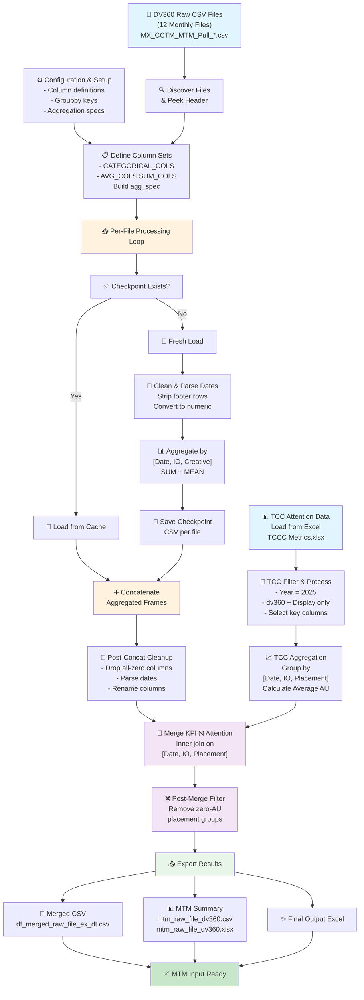

# DV360 MTM Data Processing Architecture

## Pipeline Stages

### 1. **Data Discovery** (Blue)
- Load 12 monthly DV360 CSV files
- Peek at schema to identify available columns

### 2. **Per-File Processing** (Orange)
- **Checkpoint optimization**: Cache each aggregated file to enable restarts
- **Memory-efficient loading**: Parse only required columns (`usecols`)
- **Data cleaning**: Strip footers, parse mixed date formats, normalize device types
- **Aggregation**: Group by `[Date, IO ID, Creative]` and apply SUM/MEAN

### 3. **TCC Attention Data** (Blue)
- Load Excel workbook with AU (Attention Units) metrics
- Filter for 2025, dv360, Display channel
- Aggregate and calculate Average AU

### 4. **Merge & Filter** (Purple)
- Inner join on `[Date, IO ID, Placement]`
- Remove placements with zero attention signal
- Drop all-zero columns

### 5. **Export** (Green)
- Generate merged dataset CSV
- Create MTM input summary (CSV + XLSX)
- Ready for downstream model consumption

## Key Optimizations

- **Per-file aggregation** → Peak memory bounded to single file
- **Checkpoint resumption** → Skip already-processed files on reruns
- **Column filtering** → Only parse needed columns from disk
- **Pre-aggregation concat** → Concatenate small pre-aggregated frames instead of massive raw dataset
